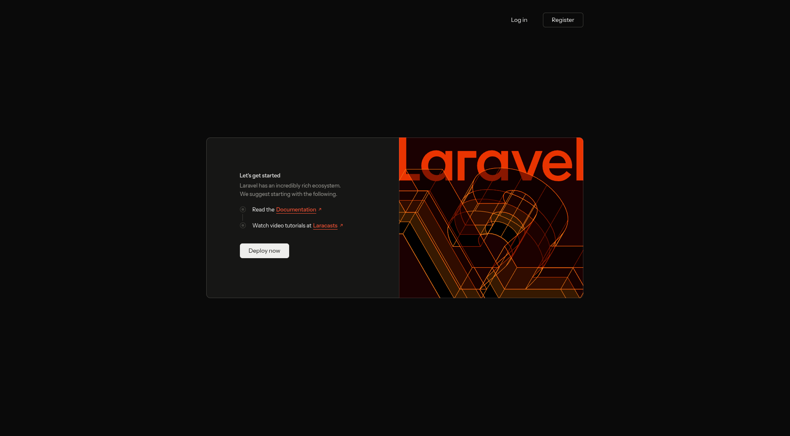

# Laravel + React Inertia Boilerplate

My opinionated full-stack starter that pairs **Laravel 12**, **Inertia.js 2**, and **React 19 + TypeScript**. It bundles authentication (Fortify), typed routing (Wayfinder), Tailwind CSS v4, Radix UI primitives, Pest, ESLint/Prettier, and a Dockerized Postgres workflow so I can spin up new SaaS-style projects in minutes.

<p align="center">

  
      
</p>

<p align="center">

  <a href="https://laravel.com" target="_blank" rel="noopener">
    
  </a>
  <a href="https://inertiajs.com" target="_blank" rel="noopener">
    
  </a>
  <a href="https://react.dev" target="_blank" rel="noopener">
    
  </a>
  <a href="https://tailwindcss.com" target="_blank" rel="noopener">
    
  </a>
  <a href="https://pestphp.com" target="_blank" rel="noopener">
    
  </a>
  <a href="https://www.docker.com/" target="_blank" rel="noopener">
    
  </a>
  
</p>

## Stack Highlights

- Laravel 12 with Fortify auth, Wayfinder, queue worker, Pail log tailing, Pest test suite.
- Inertia.js bridge with a React 19 + TypeScript front end, SSR-ready (see `composer dev:ssr`).
- Tailwind CSS v4 via the official Vite plugin, plus Radix UI, Lucide icons, shadcn-style utilities (CVA, clsx, tailwind-merge).
- Opinionated scripts for setup, local dev, DB lifecycle, QA, and deployments.
- Docker helper (`docker/run-database.sh`) to run a disposable Postgres instance.

## Requirements

- PHP 8.2+, Composer
- Node 20+ (tested with npm) and Vite requirements (esbuild/rollup binaries already pinned)
- Docker (for the optional Postgres helper)
- SQLite/Postgres client libraries if you plan to switch drivers

## First Run

```bash
git clone <repo> laravel-boilerplate
cd laravel-boilerplate
composer install
cp .env.example .env
php artisan key:generate
composer run db:up        # optional: launches Postgres via Docker
php artisan migrate --seed
npm install
npm run dev               # or run `composer run dev` to start everything at once
```

> Quick path: `composer run setup` installs PHP deps, copies `.env`, generates the key, runs migrations, installs Node deps, and builds assets. Use it only on a brand-new clone; it will re-run `composer install`.

### Environment flags worth updating

```
APP_URL=http://localhost:8000
FRONTEND_URL=http://localhost:5173
DB_CONNECTION=pgsql
DB_HOST=127.0.0.1
DB_PORT=5432
DB_DATABASE=laravel_db
DB_USERNAME=laravel_user
DB_PASSWORD=laravel_password
```

Switch to SQLite (or another driver) by editing the usual `DB_*` keys. Mail, queue, and cache drivers follow the default Laravel conventions.

## Database Helpers

- `composer run db:up` &rarr; runs `docker/run-database.sh`, which ensures Docker is running, removes old `postgres_local`, and starts a clean container with persistent volume `pgdata18`.
- `composer run db:down` &rarr; stops the container gracefully.
- `composer run db:restart` &rarr; restarts (or recreates) the container.

Feel free to customize the script if you need different ports, versions, or credentials.

## Daily Dev Loop

| Command | Purpose |
| --- | --- |
| `composer run dev` | Launches PHP server, queue listener, Pail log tail, and Vite dev server concurrently. |
| `composer run dev:ssr` | Same as `dev`, but also boots the Inertia SSR server after building. |
| `npm run dev` | Vite-only frontend watch if you already run PHP with another process manager. |
| `npm run build` / `npm run build:ssr` | Production builds (client-only or hybrid SSR). |

## Quality & Testing

| Command | Description |
| --- | --- |
| `composer test` | Clears config cache and runs the Pest suite. |
| `npm run lint` | ESLint w/ React, hooks, and Prettier rules (`--fix`). |
| `npm run format` / `npm run format:check` | Prettier for resources. |
| `npm run types` | TypeScript project check (no emit). |

Laravel Pint is available (`./vendor/bin/pint`) if you want consistent PHP formatting, and `phpstan` can be added later if needed.

## Project Layout Cheat Sheet

- `app/` – HTTP layer, actions, Fortify scaffolding, and domain services.
- `resources/js/` – Inertia entrypoints (`app.tsx`, `ssr.tsx`), Wayfinder routes, shared layouts, hooks, and page modules.
- `resources/views/` – Blade views for the root Inertia mount and email templates.
- `routes/` – API/web route files that align with Wayfinder definitions.
- `docker/run-database.sh` – Handy Postgres bootstrapper.
- `tests/` – Pest specs; ships with the usual Laravel testing helpers.

## Deploy Notes

1. Run `composer install --no-dev` and `php artisan optimize`.
2. Build assets (`npm run build` or `npm run build:ssr`) and upload the `public/build` + `bootstrap/cache`.
3. Ensure queues (and the optional SSR process) are supervised in production.
4. Publish Fortify assets or custom views if you override auth flows.

---

This repository is my personal boilerplate. Feel free to fork and adapt, but expect breaking changes whenever I tweak my own stack. If you have questions or ideas, open an issue and I’ll take a look when I can.
